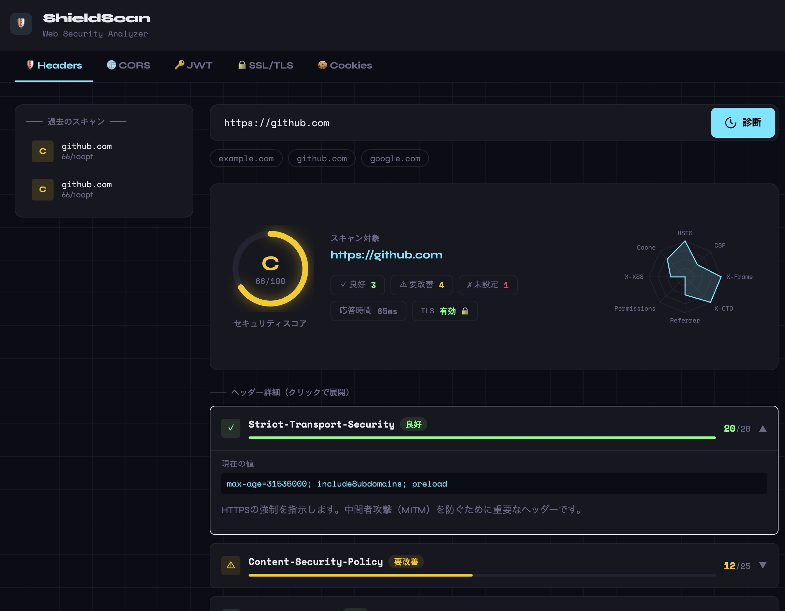

# ShieldScan

URLのHTTPレスポンスヘッダーを解析し、セキュリティスコアとグレードを算出するWebツールです。  
セキュリティヘッダーの評価に加え、CORS・JWT・SSL/TLS・Cookieの診断機能を備えています。



---

## 機能

| タブ | 概要 |
|---|---|
| **Security Headers** | 8種類のセキュリティヘッダーをスコアリングし、A+〜Fのグレードを算出 |
| **CORS Scan** | CORSミスコンフィグ（オリジン反射・Nullオリジン・ドメイン前後一致）を診断 |
| **JWT Analyzer** | JWTトークンを静的解析（alg:none・kid インジェクション・有効期限・機密情報の混入）|
| **SSL/TLS Check** | TLSバージョン・暗号スイート・証明書の有効期限・ホスト名一致を検査 |
| **Cookie Audit** | Secure・HttpOnly・SameSite フラグの設定状況を監査 |

その他:
- レーダーチャートによるヘッダースコアの可視化
- 各問題点に対する日本語の改善アドバイス
- スキャン履歴（直近50件、新しい順）

## Tech Stack

- **Backend**: Go
- **Frontend**: React + Vite + Tailwind CSS + Recharts
- **インフラ**: Docker / Docker Compose

## クイックスタート

### Docker Compose（推奨）

```bash
git clone https://github.com/nobuo-miura/ShieldScan
cd ShieldScan
docker compose up --build
```

ブラウザで `http://localhost:3000` にアクセスしてください。

### ローカル開発

```bash
# Backend（ポート 8080）
cd backend
go run ./cmd/server

# Frontend（別ターミナル、ポート 5173）
cd frontend
npm install
npm run dev
```

フロントエンドの `/api` リクエストは Vite の開発プロキシ経由でバックエンドに転送されます。

## API

### POST /api/analyze — セキュリティヘッダー診断

```json
// Request
{ "url": "https://example.com" }

// Response
{
  "url": "https://example.com",
  "final_url": "https://example.com/",
  "total_score": 75,
  "max_score": 100,
  "grade": "B",
  "tls_enabled": true,
  "response_time_ms": 312,
  "headers": [
    {
      "name": "Strict-Transport-Security",
      "present": true,
      "value": "max-age=31536000; includeSubDomains",
      "score": 15,
      "max_score": 20,
      "status": "warning",
      "description": "...",
      "advice": "..."
    }
  ]
}
```

### POST /api/cors — CORS診断

```json
// Request
{ "url": "https://example.com" }
```

### POST /api/jwt — JWT解析

```json
// Request
{ "token": "<JWT文字列>" }
```

### POST /api/ssl — SSL/TLS診断

```json
// Request
{ "host": "example.com", "port": "443" }
// port は省略可（デフォルト: 443）
```

### POST /api/cookies — Cookie監査

```json
// Request
{ "url": "https://example.com" }
```

### GET /api/history — スキャン履歴

直近50件を新しい順で返します。

### GET /health — ヘルスチェック

```json
{ "status": "ok" }
```

## ディレクトリ構成

```
shieldscan/
├── backend/
│   ├── cmd/server/         # エントリーポイント
│   └── internal/
│       ├── analyzer/       # 各種スキャンロジック
│       │   ├── analyzer.go # セキュリティヘッダー評価
│       │   ├── cors.go     # CORS診断
│       │   ├── jwt.go      # JWT解析
│       │   ├── ssl.go      # SSL/TLS診断
│       │   └── cookie.go   # Cookie監査
│       ├── handlers/       # HTTPハンドラー
│       └── models/         # インメモリ履歴ストア
├── frontend/
│   └── src/
│       └── components/     # 各診断タブのUIコンポーネント
└── docker-compose.yml
```

## License

MIT
