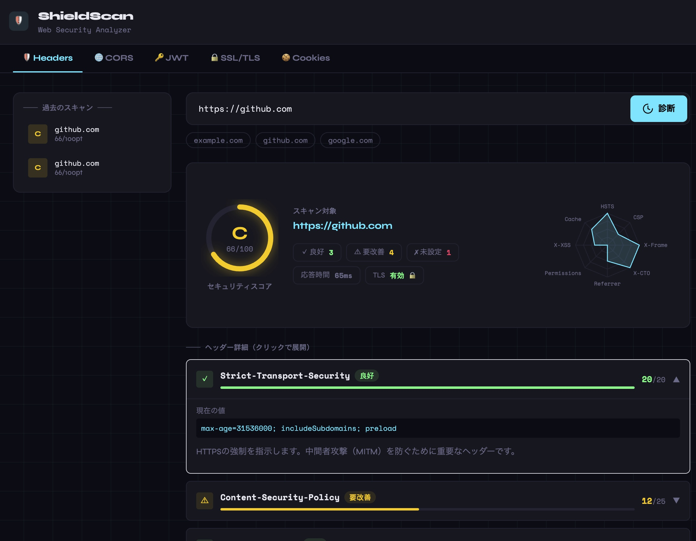

# ShieldScan

[English](README.md) | [日本語](README.ja.md)

A web-based security scanning tool that analyzes HTTP response headers, scores them, and assigns a grade.
In addition to security header evaluation, it provides diagnostics for CORS, JWT, SSL/TLS, and Cookies.



---

## Features

| Tab | Description |
|---|---|
| **Security Headers** | Scores 8 security headers and assigns a grade from A+ to F |
| **CORS Scan** | Detects CORS misconfigurations (origin reflection, null origin, pre/post-domain match) |
| **JWT Analyzer** | Static analysis of JWT tokens (alg:none, kid injection, expiration, sensitive data in payload) |
| **SSL/TLS Check** | Inspects TLS version, cipher suite, certificate expiry, and hostname match |
| **Cookie Audit** | Audits Secure, HttpOnly, and SameSite flag configurations |

Additional features:
- Radar chart visualization of per-header scores
- Improvement advice for each detected issue
- Scan history (latest 50 entries, newest first)

## Tech Stack

- **Backend**: Go
- **Frontend**: React + Vite + Tailwind CSS + Recharts
- **Infrastructure**: Docker / Docker Compose

## Quick Start

### Docker Compose (recommended)

```bash
git clone https://github.com/nobuo-miura/ShieldScan
cd ShieldScan
docker compose up --build
```

Open `http://localhost:3000` in your browser.

### Local Development

```bash
# Backend (port 8080)
cd backend
go run ./cmd/server

# Frontend (separate terminal, port 5173)
cd frontend
npm install
npm run dev
```

Frontend `/api` requests are forwarded to the backend via Vite's development proxy.

## Configuration

| Environment variable | Default | Description |
|---|---|---|
| `PORT` | `8080` | Backend listen port. A non-numeric value stops the server at startup. |
| `SHIELDSCAN_ALLOW_PRIVATE` | off | Allows scanning private and loopback addresses. **This disables SSRF protection — local development only.** |
| `SHIELDSCAN_TRUST_PROXY` | off | Uses `X-Forwarded-For` to identify clients. Enable only behind a reverse proxy that overwrites this header. |

To scan a service running on your own machine:

```bash
(cd backend && SHIELDSCAN_ALLOW_PRIVATE=true go run ./cmd/server)
```

Setting this on a public instance lets anyone reach your internal network through your server. See [SECURITY.md](SECURITY.md).

## Security

ShieldScan sends requests to arbitrary user-supplied URLs from the server, which makes SSRF its central risk. Every outbound TCP connection passes through a hook that inspects the actual resolved IP immediately before connecting, so DNS rebinding and redirect-based bypasses are both covered.

However, **there is no authentication and scan history is shared across all users.** Read [SECURITY.md](SECURITY.md) before exposing an instance to the internet.

Scans send real requests. Only scan systems you own or have explicit permission to test.

## Development

Run from the repository root — each line uses a subshell so your working directory is unchanged:

```bash
(cd backend && gofmt -l . && go vet ./... && go test -race ./... && golangci-lint run ./...)
(cd frontend && npm run lint && npm run build)
```

See [CONTRIBUTING.md](CONTRIBUTING.md) to contribute.

## API

Base URL depends on how you run it:

- **Docker Compose** — `http://localhost:3000/api/...`, proxied by nginx. The backend container is deliberately not published to the host, so that rate limiting can trust the proxy's client-IP header.
- **Local development** — `http://localhost:8080/api/...` directly.

### POST /api/analyze — Security Header Scan

```json
// Request
{ "url": "https://example.com" }

// Response
{
  "url": "https://example.com",
  "final_url": "https://example.com/",
  "total_score": 75,
  "max_score": 100,
  "grade": "B",
  "tls_enabled": true,
  "response_time_ms": 312,
  "headers": [
    {
      "name": "Strict-Transport-Security",
      "present": true,
      "value": "max-age=31536000; includeSubDomains",
      "score": 15,
      "max_score": 20,
      "status": "warning",
      "description": "...",
      "advice": "..."
    }
  ]
}
```

### POST /api/cors — CORS Scan

```json
// Request
{ "url": "https://example.com" }
```

### POST /api/jwt — JWT Analysis

```json
// Request
{ "token": "<JWT string>" }
```

### POST /api/ssl — SSL/TLS Check

```json
// Request
{ "host": "example.com", "port": "443" }
// port is optional (default: 443)
```

### POST /api/cookies — Cookie Audit

```json
// Request
{ "url": "https://example.com" }
```

### GET /api/history — Scan History

Returns the latest 50 entries in descending order.

### GET /health — Health Check

```json
{ "status": "ok" }
```

## Directory Structure

```
shieldscan/
├── backend/
│   ├── cmd/server/         # Entry point
│   └── internal/
│       ├── analyzer/       # Scan logic
│       │   ├── analyzer.go # Security header evaluation
│       │   ├── cors.go     # CORS diagnostics
│       │   ├── jwt.go      # JWT analysis
│       │   ├── ssl.go      # SSL/TLS diagnostics
│       │   └── cookie.go   # Cookie audit
│       ├── handlers/       # HTTP handlers, rate limiting
│       ├── safehttp/       # SSRF-resistant HTTP client and dialer
│       └── models/         # In-memory history store
├── frontend/
│   └── src/
│       └── components/     # UI components for each scan tab
└── docker-compose.yml
```

All outbound requests go through `internal/safehttp`. Never construct a bare `http.Client` in a scanner — that is what keeps SSRF protection in place.

## License

MIT
